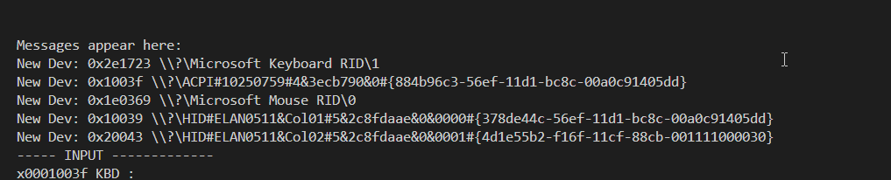

# Windows Background Input tests
In this repository is a number of tests for interfacing with windows apis that have the ability to get input from the background.
The main program is `RawInputTool` which reports to the console
- individual device activity (press, release, move, scroll, key-repeat) 
- logs devices being plugged in/out.

Here's it in action.
